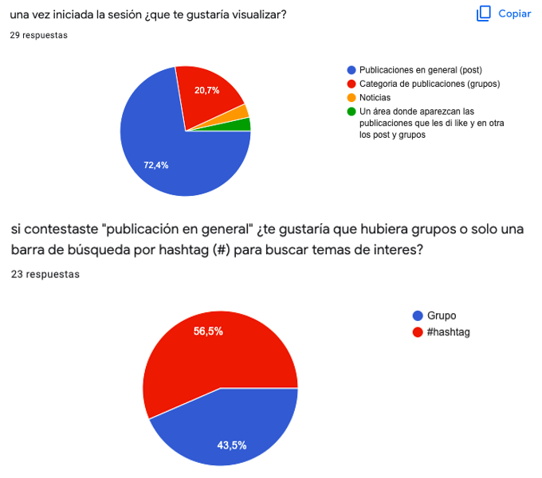

# petsLifes.

Usuario: 
* Dueños de mascotas.

petsLifes nace para satisfacer la necesidad de los dueños o futuos dueños de animales, de obtener mas información sobre cuidados, alimentación, medicamentos, lugares petfriendly, entre otras cosas. En esta red social los usuarios podrán escribir sobre cualquier tema relacionado con animales, exceptuando la venta de estos, ya que el objetivo principal es ayudarse entre usuarios sin buscar un beneficio monetario.

* Prueba la app aquí. [petsLifes](https://social-network-petslifes.netlify.app/)

## ENCUESTA

Link encuesta: (https://docs.google.com/forms/d/e/1FAIpQLSePRIVkioB1qoC0nuAehYLPYWL8g-jnZlPiRfMjkQFBnbgkxw/viewform?usp=sf_link)

## HISTORIAS DE USUARIO

* yo como: dueño de una mascota
quiero: datos de locales PetFriendly
para: salir a comer mientras paseo a mi perro

* yo como: dueño de mascota
quiero: crear contenido con hashtag
para: compartir mis tips con otros usuarios y asi que lo puedan buscar por tema

* yo como: usuario
quiero: ver el logo de la app e iniciar sesión
para: saber que es una app confiable

* yo como: usuario
quiero: ingresar mis datos (correo y contraseña)
para: acceder a la app

* yo como: usuario
quiero: poder ocupar mi email para registrarme, sin agregar tantos datos
para: que sea un formulario corto y rapido de llenar.

* yo como: usuario
quiero: una aplicación simple
para: que sea facil de usar

* yo como: usuario
quiero: poder ver una lista de mis post
para: poder revisarlos, editarlos o borrarlos

## PROTOTIPO

* [Prototipo de alta](https://www.figma.com/proto/KqFH0YG253lipctE3YSbTi/Pets-Social?scaling=scale-down&page-id=0%3A1&node-id=46%3A6&starting-point-node-id=46%3A6) (click para ver animado)

## DESARROLLO

* Comenzamos definiendo el tema de nuestra app, las mascotas.
* Definimos una encuesta pequeña para nuestras historias de usuario, ademas de consultas sobre el diseño e interacciones.
* Con las respuestas de la encuesta listas, definimos las historias de usuario y empezamos a recopilar imágenes para integrar a la app.
* Con lo anterior ya listo, procedimos a planificar el cómo trabajaríamos y que partes de la app serian las primeras ah desarrollar y cuales serian las ultimas. 
* Empezamos por hacer el enrutamiento de nuestra SPA, para luego insertar los template de cada vista junto con su CSS.
* Teniendo lo básico de nuestra app ( router y template ), empezamos con la configuración inicial de Firebase, el cual utilizaríamos para los inicios de sesión y el almacenamiento de toda la data generada y ocupada por la app.
* En el proceso surgieron pequeños contratiempos, principalmente con los métodos proporcionados por Firebase, pero no fue nada que no se pudiera solucionar.
* La ultima parte del desarrollo de la app, fue el testear, las funciones asíncronas que utilizamos para la Interacción con Firebase.
* Al finalizar la app se alcanzo a lograr el 95% de las cosas que se pensaron integrar originalmente en la app, ya que falto la confirmación antes de eliminar el post y la opción de poder editar el post.
